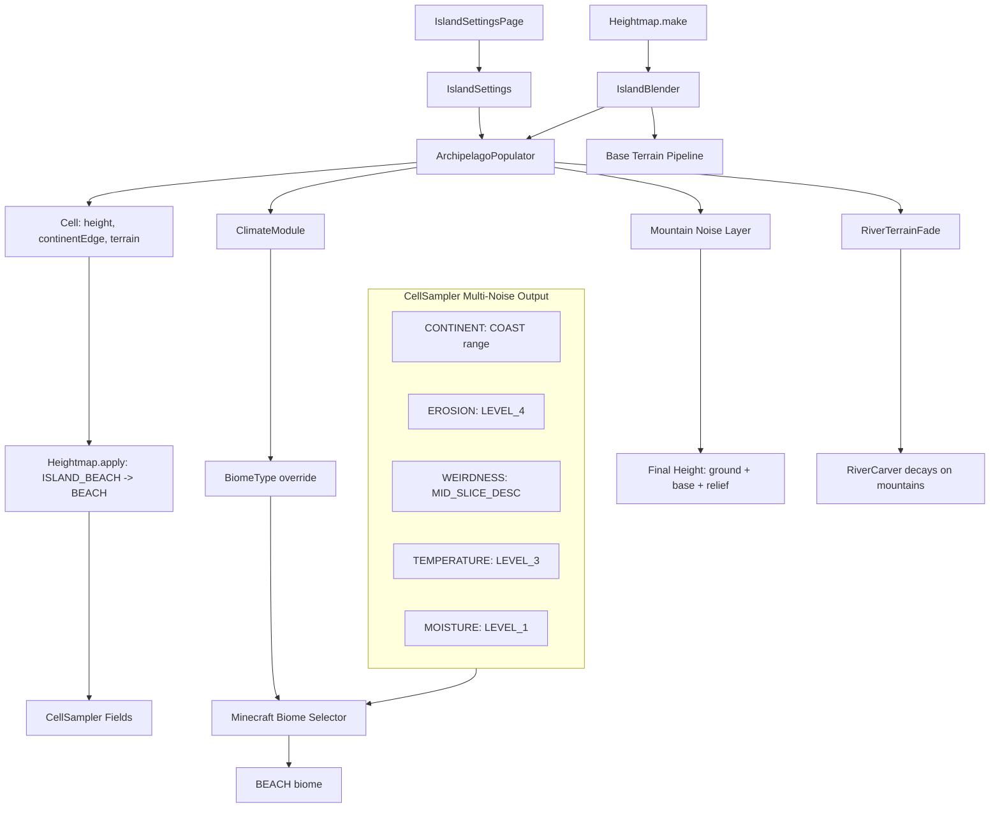

# ReTerraForged Archipelago Terrain System — Architecture

This document describes the island/archipelago terrain system implemented for **ReTerraForged**, a fork of [NeoTerraForged](https://github.com/equalizer32/NeoTerraForged/tree/1.20.1) for Minecraft 1.20.1 Forge.

---

## Overview

The archipelago system adds a configurable island terrain layer to the existing terrain generation pipeline. Islands are placed in ocean areas with:

- Irregular, natural-looking coastlines (not round/elliptical)
- Continuous ocean-to-land height blending (no cliffs)
- Multi-layer mountain terrain (ridges, hills, volcanoes)
- Proper Minecraft biome assignment (BEACH, land biomes)
- River carving protection on island mountains

Three major subsystems were added:

| System | Purpose |
|--------|---------|
| **Archipelago Populator** | Island shape, height blending, terrain type assignment |
| **Biome/Climate Override** | Force land biomes on island cells instead of ocean |
| **River Terrain Fade** | Smooth river disappearance on mountain terrain |

---

## Pipeline Integration

The island system hooks into the existing `Heightmap` pipeline at two points.

### Terrain Pipeline (Heightmap.make)

```
Heightmap.make() builds the terrain pipeline as:
  ContinentLerper2(Oceans, Land, controlPoints.shallowOcean, controlPoints.inland)
```

The archipelago wraps around the entire pipeline:

```java
if (ctx.preset.island().enableArchipelago) {
    terrain = new IslandBlender(
        terrain,
        new ArchipelagoPopulator(ctx.preset.island(), ctx.levels, controlPoints),
        ctx.levels
    );
}
```

### IslandBlender

`IslandBlender` is a `CellPopulator` that:

1. Runs the base terrain pipeline first (ocean/coast/land)
2. Only delegates to `ArchipelagoPopulator` if the cell is ocean or coast terrain
3. Otherwise skips (existing land is preserved)

```java
public void apply(Cell cell, float x, float z) {
    this.baseTerrain.apply(cell, x, z);  // run base pipeline
    if (cell.terrain != null && cell.terrain.isOverground() && !cell.terrain.isCoast()) {
        return;  // land cell, skip
    }
    this.archipelago.apply(cell, x, z);  // ocean/coast -> run island gen
}
```

### Application Order

During `Heightmap.apply()`, the cell processing order is:

```
1. applyTerrain()  → continent → region → terrain (includes IslandBlender)
2. ISLAND_BEACH → TerrainType.BEACH remap
3. applyRivers()   → river carving + volcano type
4. applyClimate()  → biome/climate assignment + river guard
```

---

## ArchipelagoPopulator — Island Generation

`ArchipelagoPopulator` is the core of the system. It processes every ocean/coast cell and produces a continuous `islandAlpha` value that drives all downstream decisions.

### Noise Configuration

| Noise | Type | Scale | Purpose |
|-------|------|-------|---------|
| `sizeNoise` | Warped simplex ×3 | `islandSize * 3.5 / hScale` | Individual island shape |
| `densityNoise` | Warped simplex ×2 | 4000 → 2000 | Cluster spread/distribution |
| `ridgeHeight` | Perlin ridge (4 oct) | `islandSize * 1.6 / hScale` | Mountain ridge lines |
| `hillHeight` | Billow (3 oct) | `islandSize * 0.35 / hScale` | Rolling hills fill |
| `volcanoHeight` | Perlin ridge^1.8 (3 oct) | `islandSize * 0.45 / hScale` | Steep volcanic peaks |
| `mountainSelector` | Simplex (2 oct) | `islandSize * 1.25 / hScale` | Mountain placement |
| `volcanoSelector` | Simplex (2 oct) | `islandSize * 1.75 / hScale` | Volcano placement |

`hScale` = `islandHorizontalScale` (UI config), allowing the user to stretch/compress the entire island noise field.

### Two-Phase Island Alpha

**Phase 1 — Shape Alpha:** `sizeNoise` produces values [0,1] at the islandSize scale. Three cascading warp passes create irregular, organic shapes (no Voronoi-based circular islands).

**Phase 2 — Density Alpha:** `densityNoise` operates at a much larger scale (4000), controlling clustering. A configurable `islandDensity` threshold (mapped to 0.05–0.98) gates the density fade:

```java
float densityThreshold = clamp(1.0F - islandDensity * 0.8F, 0.05F, 0.98F);
float densityFade = clamp((1.0F - densityThreshold) * 0.5F, 0.04F, 0.12F);
float densityAlpha = smoothStep(densityThreshold, densityThreshold + densityFade, densityValue);

float islandAlpha = shapeAlpha * densityAlpha;
```

### Height Profile

The continuous `islandAlpha` drives a 4-segment height profile using hermite smoothsteps (`smoothstep` = `t²(3-2t)`):

```
islandAlpha:  0 ─────────────── shelfEnd ──── beachEnd ─────────────── 1
              │                    │             │                      │
height:   ocean floor ─── shallow shelf ── beach/ground ──── island target
              │                    │             │                      │
              │              shelfTarget    ground+beach         ground+base+relief
              │            (water(-depth))   blend                   (full land)
```

**Shelf segment** (0 → shelfEnd): Blends from ocean floor up to `water(-offshoreDepth)`. Creates a gentle continental shelf approach.

**Beach segment** (shelfEnd → beachEnd): Blends from shelf height up to `levels.ground`. This creates the visible beach shoreline.

**Land segment** (beachEnd → 1.0): Blends from ground up to target height = `ground + baseHeight + reliefHeight`.

### Terrain Type Assignment

Based on `islandAlpha` and `mountainAlpha`:

| Condition | Terrain Type |
|-----------|-------------|
| `islandAlpha < shelfEnd` | `SHALLOW_OCEAN` |
| `shelfEnd <= islandAlpha < beachEnd` | `ISLAND_BEACH` |
| `mountainAlpha > 0.35` and `mountainValue > 0.35` and chance gate passes | `ISLAND_MOUNTAINS` |
| Otherwise | `ISLAND` (flat/gentle island) |

### Continentalness Edge

`ArchipelagoPopulator.continentEdge()` maps islandAlpha to a continentalness value that feeds into `CellSampler`:

```
islandAlpha:  0 ─── shelfEnd ─── beachEnd ─── 1
continentEdge: deepOcean ─ shallowOcean ─ coast ─ inland
```

This ensures the vanilla Minecraft biome selector sees appropriate continentalness values for each island zone.

---

## Mountain System

### Three-Layer Noise

Mountain height is a weighted combination of three noise layers:

```java
float hillValue = hillHeight * (0.15 + mountainGate * 0.55);
float ridgeValue = ridgeHeight * mountainGate;
float volcanoValue = volcanoHeight * volcanoGate;
float mountainValue = clamp(hillValue * 0.35 + ridgeValue * 0.5 + volcanoValue * 0.75, 0, 1);
```

### Chance Gates

`mountainChance` and `volcanoChance` control how much of the island area gets each mountain type. The `chanceMask()` function uses a noise sampler with smoothstep threshold:

```java
float threshold = 1.0F - chance;
return smoothStep(threshold, min(1.0F, threshold + 0.2F), selector);
```

The 0.2 fade margin prevents hard edges between mountain/non-mountain areas.

### Edge Attenuation

`mountainAlpha` is computed from `islandAlpha` with configurable start/end:

```java
float mountainStart = clamp(beachEnd + 0.08F, 0.22F, 0.9F);
float mountainEnd = max(mountainStart + 0.08F, 0.72F);
float mountainAlpha = smoothStep(mountainStart, mountainEnd, islandAlpha);
```

This means mountains only appear toward the interior of larger islands, never near the beach.

### Final Height

```java
float baseHeight = islandHeight * (0.015F + islandBaseScale * 0.08F);
float reliefHeight = mountainValue * mountainAlpha * islandHeight * islandVerticalScale * 0.3F;
float targetHeight = levels.ground + baseHeight + reliefHeight;
```

---

## Biome Assignment & Beach Fix

Ensuring islands get correct Minecraft biomes (not ocean/frozen_ocean) required multiple layers of intervention.

### Heightmap.apply() — Terrain Remap

Immediately after terrain generation:

```java
if (cell.terrain == TerrainType.ISLAND_BEACH) {
    cell.terrain = TerrainType.BEACH;
}
```

This remaps the internal `ISLAND_BEACH` type to standard Minecraft `BEACH`, so the beach terrain layer itself is recognized as beach.

### CellSampler — Multi-Noise Parameter Fix

Minecraft's biome selection uses a 5-dimensional hypercube (continentalness, erosion, weirdness, temperature, humidity). The `CellSampler` fields produce these values. For `ISLAND_BEACH` terrain:

| CellSampler Field | Returned Value | Effect |
|-------------------|---------------|--------|
| `CONTINENT` | `COAST.min() + (COAST.max() - COAST.min()) * 0.3` | Coastal continentalness |
| `EROSION` | `Erosion.LEVEL_4.mid()` | Moderate erosion |
| `WEIRDNESS` | `Weirdness.MID_SLICE_NORMAL_DESCENDING.mid()` | Non-valley weirdness |
| `TEMPERATURE` | `Temperature.LEVEL_3.mid()` | Warm |
| `MOISTURE` | `Humidity.LEVEL_1.mid()` | Dry |

These fixed values are chosen specifically because they target the BEACH biome in Minecraft's biome table for 1.20.1.

### CellSampler.Cache2d — Synchronous Parameter Write

The `Cache2d.getAndUpdate()` method writes all four mutable parameters (erosion, weirdness, temperature, moisture) in one place, ensuring no race conditions between individual field reads:

```java
if (this.cell.terrain == TerrainType.ISLAND_BEACH) {
    this.cell.erosion = Erosion.LEVEL_4.mid();
    this.cell.weirdness = Weirdness.MID_SLICE_NORMAL_DESCENDING.mid();
    this.cell.temperature = Temperature.LEVEL_3.mid();
    this.cell.moisture = Humidity.LEVEL_1.mid();
}
```

### ClimateModule — Fallback Biome Override

`ClimateModule` provides a secondary override for island terrain:

- **ISLAND_BEACH**: forced to `BiomeType.SAVANNA` with `Temperature.LEVEL_3` + `Humidity.LEVEL_1` (this is a fallback; CellSampler takes precedence)
- **ISLAND / ISLAND_MOUNTAINS**: samples temperature and moisture at the Voronoi cell center, producing correct land biomes matching the latitude

The `modifyTerrain()` method in `ClimateModule` also guards against ISLAND terrain being overwritten to COAST:

```java
if (cell.terrain.isOverground() && !cell.terrain.overridesCoast()
    && continentEdge <= coastMarker()
    && cell.terrain != ISLAND && cell.terrain != ISLAND_BEACH && cell.terrain != ISLAND_MOUNTAINS) {
    cell.terrain = TerrainType.COAST;
}
```

---

## Data Flow Diagram



---

## River Protection

### Heightmap.applyClimate() Guard

In `applyClimate()`, river valley erosion override is skipped for island terrain:

```java
if (cell.riverMask < riverValleyThreshold && !isIslandTerrain(cell)) {
    cell.erosion = 0.445F;
    cell.weirdness = 0.34F;
}

private static boolean isIslandTerrain(Cell cell) {
    return cell.terrain == TerrainType.ISLAND 
        || cell.terrain == TerrainType.ISLAND_BEACH 
        || cell.terrain == TerrainType.ISLAND_MOUNTAINS;
}
```

### RiverTerrainFade

`RiverTerrainFade` provides a unified fade calculator for river carving on mountain terrain. It is used by `RiverCarver` and `Wetland` classes.

**Key API:**

```java
// Unified mountain check (covers ISLAND_MOUNTAINS and standard MOUNTAINS)
RiverTerrainFade.isMountain(cell)  // cell.terrain.isMountain()

// Height-based fade [1.0 at startHeight, 0.0 at endHeight]
RiverTerrainFade.heightFade(height, startHeight, endHeight)

// Terrain region edge fade for mountain cells
RiverTerrainFade.mountainFade(cell)

// Three-layer fade output
RiverTerrainFade.valleyFade(cell, heightFade)  // retains partial valley (0.2 on mountains)
RiverTerrainFade.banksFade(cell, heightFade)   // fully suppressed on mountains (0.0)
RiverTerrainFade.bedFade(cell, heightFade)     // fully suppressed on mountains (0.0)

// River tagging guard
RiverTerrainFade.canTagRiver(banksFade, bedFade)
```

The fade values on mountain terrain:
| Fade Type | Mountain Factor | Effect |
|-----------|--------|---------|
| `valleyFade` | `0.2` | Retains a narrow valley trace, preventing the river from creating a visible cliff face |
| `banksFade` | `0.0` | Fully suppressed — no river banks cut into mountain sides |
| `bedFade` | `0.0` | Fully suppressed — no river bed carved through peaks |

---

## UI Configuration

`IslandSettingsPage` provides a full configuration screen with 12 controls:

| Widget | Parameter | Range | Default |
|--------|-----------|-------|---------|
| Toggle | `enableArchipelago` | on/off | off |
| Slider | `islandDensity` | 0.0–1.0 | 0.5 |
| Slider | `islandSize` | 50–500 | 200.0 |
| Slider | `islandHeight` | 0.1–1.0 | 0.5 |
| Slider | `islandBaseScale` | 0.1–2.0 | 0.3 |
| Slider | `islandVerticalScale` | 0.1–3.0 | 1.0 |
| Slider | `islandHorizontalScale` | 0.1–3.0 | 1.0 |
| Slider | `mountainChance` | 0.0–1.0 | 0.3 |
| Slider | `volcanoChance` | 0.0–1.0 | 0.1 |
| Slider | `offshoreDepth` | 0.1–1.0 | 0.5 |
| Slider | `beachWidth` | 0.05–0.5 | 0.15 |
| Slider | `beachCoverage` | 0.0–1.0 | 0.3 |

Each slider change triggers `regenerate()`, allowing real-time preview in the preset configuration screen.

---

## Bonus: Mountain Biome Region Fix

The mountain region fix ensures that mountain terrain areas get a single unified biome across the entire mountain, rather than fragmenting into multiple biomes.

**Implementation:**

1. `Cell.java` added `terrainRegionCenterX` / `terrainRegionCenterZ` fields to store the Voronoi cell center coordinates of each terrain region
2. `RegionModule.java` computes and stores these coordinates in world space after running the Voronoi noise
3. `ClimateModule.java` uses these coordinates for HIGHLAND terrain: it samples temperature and moisture at the terrain region center (with correct `biomeFreq` scaling), producing a single biome for the entire mountain region

```java
if (cell.terrain != null && cell.terrain.getCategory() == TerrainCategory.HIGHLAND) {
    float mtnFreqX = cell.terrainRegionCenterX * this.biomeFreq;
    float mtnFreqZ = cell.terrainRegionCenterZ * this.biomeFreq;
    
    float mtnTemp = this.temperature.compute(mtnFreqX, mtnFreqZ, 0);
    float mtnMoist = this.moisture.compute(mtnFreqX, mtnFreqZ, 0);
    cell.biome = BiomeType.get(mtnTemp, mtnMoist);
}
```

---

## Source Organization

```
src/
├── archipelago/             # New files: core island system
│   ├── ArchipelagoPopulator.java
│   ├── IslandBlender.java
│   ├── IslandSettings.java
│   └── IslandSettingsPage.java
├── climate/
│   └── ClimateModule.java   # Modified: island biome overrides
├── cell/
│   └── Cell.java            # Modified: terrainRegionCenterX/Z fields
├── region/
│   └── RegionModule.java    # Modified: Voronoi cell center storage
├── densityfunction/
│   └── CellSampler.java     # Modified: ISLAND_BEACH fixed parameters
├── heightmap/
│   └── Heightmap.java       # Modified: ISLAND_BEACH -> BEACH remap
└── river/
    └── RiverTerrainFade.java # New: smooth river fade on mountains
```

All files are from the `raccoonman.reterraforged` package, based on [NeoTerraForged 1.20.1](https://github.com/equalizer32/NeoTerraForged/tree/1.20.1).

---

## License

This project is licensed under the MIT License, consistent with the upstream TerraForged project.